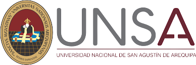
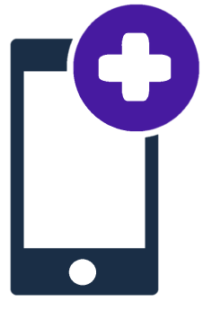

##

# MedicApp 

## Un proyecto desarrollado con Flutter y Dart

MedicApp es una aplicación con la capacidad de utilizar recetas médicas para solicitar delivery, una innovación que simplifica la validación de las mismas y representa un salto audaz hacia el futuro de la atención médica. Este valor agregado no solo facilita el proceso, sino que también refleja nuestro compromiso con la seguridad y la calidad. Destacando además que a pesar de tener como productos principales a las medicinas, también se cuentan con productos de cuidado personal, belleza y nutrición.

